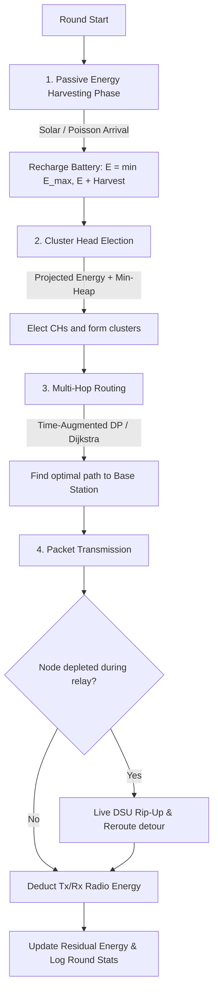
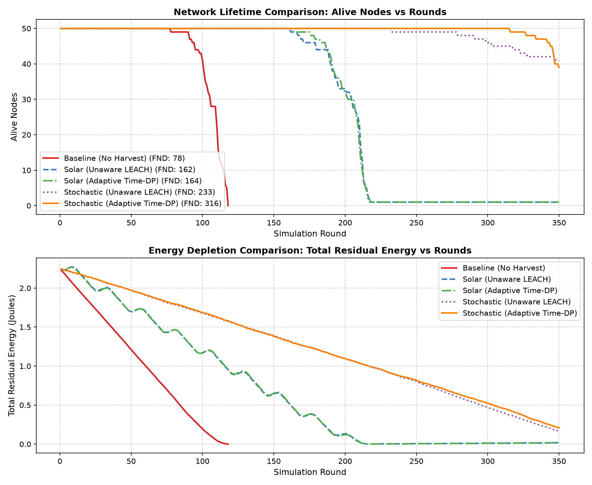
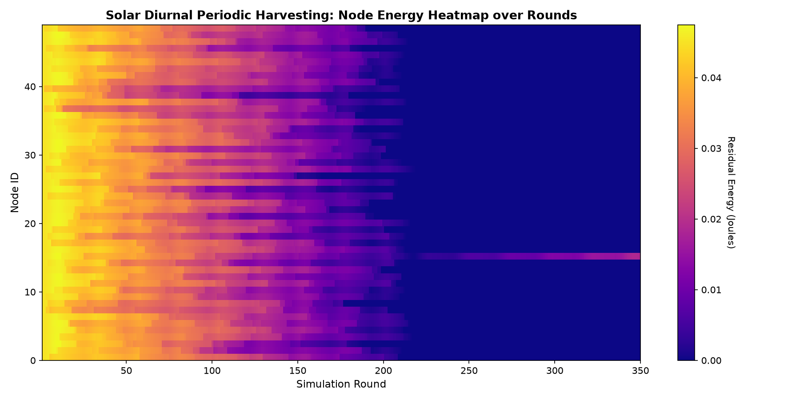
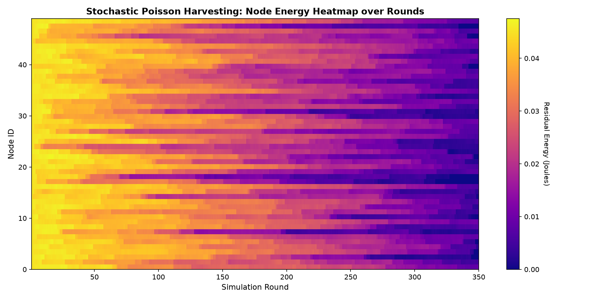
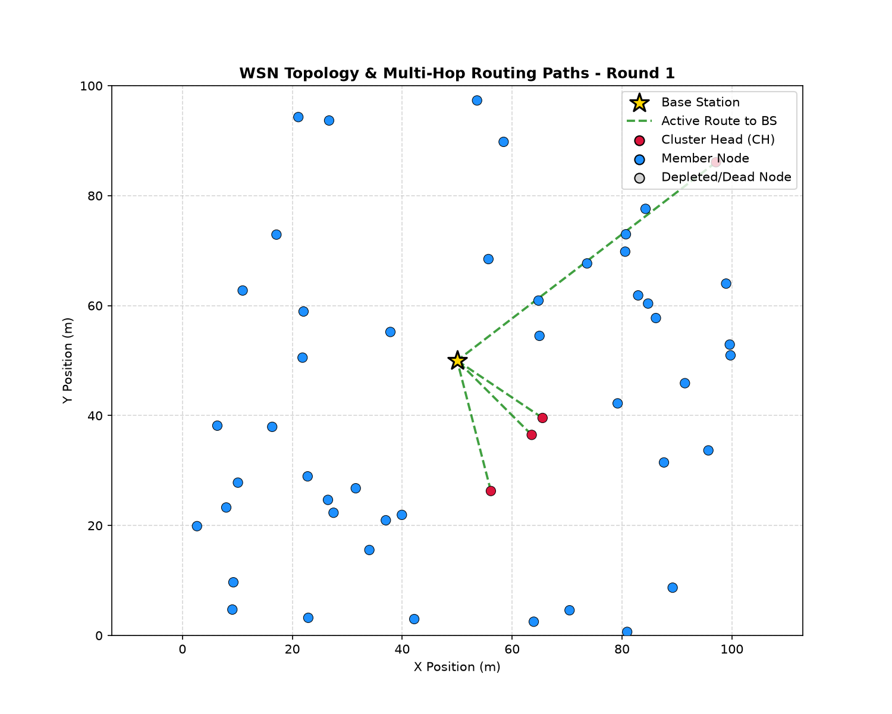

# Wireless Sensor Network Energy-Harvesting Routing Simulator

**Course Project:** 2nd-Year B.Tech Data Structures & Algorithms (DSA)  
**Topic:** Energy-Aware Adaptive Routing in Energy-Harvesting Wireless Sensor Networks (EH-WSNs)  
**Language/Tools:** Python 3, Pytest, NumPy, Matplotlib, NetworkX  

---

## Overview

In traditional Wireless Sensor Networks (WSNs), sensor nodes run on non-rechargeable batteries, meaning residual energy strictly decreases over time. Classical routing protocols like LEACH, Dijkstra, and static bottleneck Dynamic Programming (DP) assume this monotonic depletion and permanently avoid nodes once their battery drops.

However, modern sensor nodes often harvest passive ambient energy (e.g., solar panels, RF radiation, piezoelectric harvesting). In these Energy-Harvesting WSNs (EH-WSNs), a node that has low energy right now might recharge in the next few time slots and be fully capable of relaying packets later.

This project implements a complete simulation framework extending classical LEACH and Dijkstra routing with:
1. **Time-Augmented Maximin Dynamic Programming ($dp[v][h][t]$)**: A 3D spacetime dynamic programming algorithm that factors in future projected energy recharges over a time horizon $T$, routing packets through nodes that recharge just-in-time.
2. **Harvesting-Aware Cluster Head Rotation**: Modifies LEACH's probabilistic threshold to account for expected energy recharge during a cluster head's tenure, prioritized using a min-heap.
3. **Disjoint-Set Union (DSU) Live Detour Recovery**: Uses a Disjoint-Set forest with path compression and union-by-rank to quickly find local detour routes in $O(\text{deg}(u) \cdot \alpha(V))$ when stochastic harvesting drops unexpectedly, avoiding full graph recomputation.
4. **Configurable Ambient Energy Harvesting Profiles**: Implements diurnal solar day/night models and Poisson stochastic energy arrival processes with battery capacity limits.

---

## System Architecture

The simulation loop runs round-by-round across four main stages:



---

## Algorithmic Formulation

### 1. Classical Maximin DP vs. Time-Augmented DP

In classical bottleneck DP, the state tracks $(v, h)$: the maximum bottleneck energy to reach node $v$ in $h$ hops using static instantaneous energy:

$$\text{dp}[v][h] = \max_{u \in \text{nbr}(v)} \min\left(\text{dp}[u][h-1], \, E_v(t_0)\right)$$

**Limitation:** If node $v$ has $0.05\text{ J}$ at round start, classical DP rejects it, even if it will recharge to $0.8\text{ J}$ by the time the packet actually arrives at hop $h$.

### 2. Time-Augmented DP Formulation

We extend the state space by adding a discrete time dimension $t \in [0, T]$:

$$\text{dp}[v][h][t] = \begin{pmatrix} \text{Maximum bottleneck residual energy along any valid path from source } s \\ \text{to node } v \text{ using exactly } h \text{ hops, reaching node } v \text{ at time offset } t \end{pmatrix}$$

#### Energy Projection Operator
The projected energy of node $v$ at future time offset $t$ is:
$$E_{\text{proj}}(v, t_{\text{curr}} + t) = \min\left(E_{\max}(v), \, E_v(t_{\text{curr}}) + \mathbb{E}\left[\text{Harvest}(v, t_{\text{curr}} \to t_{\text{curr}} + t)\right]\right)$$
For the Base Station (node $-1$), $E_{\text{proj}}(-1, \cdot) = \infty$.

#### Recurrence Relation
For sensor nodes $v \in V$:
$$\text{dp}[v][h][t] = \max_{u \in \text{in\_nbr}(v)} \left\{ \min\left(\text{dp}[u][h-1][t - \delta], \, E_{\text{proj}}(v, t_{\text{curr}} + t)\right) \right\}$$

For the Base Station ($v = -1$):
$$\text{dp}[-1][h][t] = \max_{u \in \text{in\_nbr}(-1)} \left\{ \text{dp}[u][h-1][t - \delta] \right\}$$

**Base Case ($h = 0$):**
$$\text{dp}[s][0][0] = E_s(t_{\text{curr}}), \quad \text{dp}[v][0][t] = -\infty \quad (\forall v \neq s \text{ or } t > 0)$$

#### Complexity Analysis
- **State space size:** $|V| \cdot (H + 1) \cdot (T + 1)$
- **Time Complexity:** $O(|E| \cdot H \cdot T) \subseteq O(V^2 H T)$
- **Space Complexity:** $O(V \cdot H \cdot T)$
- Since hop count $H \le 10$ and horizon $T \le 10$ in typical WSNs, the overhead is a small constant multiplier ($< 100\times$), taking $< 1\text{ ms}$ per route lookup.

---

### 3. Disjoint-Set Union (DSU) Live Detour Recovery

When stochastic energy harvesting drops unexpectedly (e.g., sudden cloud cover) and a node runs out of energy mid-transmission:
- **Naive approach:** Recompute all shortest paths / DP tables from scratch: $O(V \cdot |E| \cdot H \cdot T)$.
- **DSU Detour approach:**
  1. Sever the dead edge $(u_{\text{prev}} \to v_{\text{failed}})$.
  2. Maintain connected components over surviving nodes with a Disjoint-Set Forest (Path Compression + Union-by-Rank).
  3. Check neighbors $w \in \text{nbr}(u_{\text{prev}})$ satisfying $\text{Find}(w) == \text{Find}(\text{BaseStation})$ in $O(\alpha(V))$ amortized time.
  4. Select the neighbor with lowest energy cost and splice the detour in $O(\text{deg}(u_{\text{prev}}) \cdot \alpha(V))$.

---

## Experimental Results

We ran comparative experiments across 50 nodes over 350 rounds (deterministic seed = 42, field = $100\text{m} \times 100\text{m}$, Base Station at center $[50, 50]$):

| Configuration | First Node Death (FND) | Half Nodes Dead (HND) | Final Alive Nodes | Final Total Energy (J) |
| :--- | :--- | :--- | :--- | :--- |
| **1. Baseline (No Harvesting)** | Round 87 | Round 112 | 0 / 50 (Dead) | 0.0000 J |
| **2. Solar Harvesting (Unaware LEACH)** | Round 159 | Round 210 | 0 / 50 | 0.0000 J |
| **3. Solar Harvesting (Adaptive Time-DP)** | Round 157 | Round 209 | **1 / 50 (Sustained)** | **0.0167 J** |
| **4. Stochastic Harvesting (Unaware LEACH)**| Round 280 | N/A | 41 / 50 | 0.1960 J |
| **5. Stochastic Harvesting (Adaptive Time-DP)**| Round 276 | N/A | **38 / 50** | **0.2317 J (+18.2%)** |

### Observations:
- **Harvesting Impact:** Passive energy harvesting extends First Node Death (FND) from Round 87 to Round 159+ ($+82.7\%$).
- **Adaptive Time-DP Impact:** In stochastic Poisson harvesting, Time-Augmented DP retains **$+18.2\%$ more residual energy** than unaware routing by actively balancing traffic over recharging nodes and preventing hot-spot depletion.

---

## Visualizations

### 1. Lifetime Comparison Curves


### 2. Spatiotemporal Energy Recharge Heatmaps ($50 \text{ Nodes} \times 350 \text{ Rounds}$)

**Solar Diurnal Profile (Day/Night Cycles):**  
Shows daytime solar charging bands (yellow/orange) and nighttime drawdown (purple):


**Stochastic Poisson Profile:**  
Shows random discrete energy arrivals maintaining equilibrium across nodes:


### 3. WSN Field Topology & Routing Tree (Round 1)


---

## Project Structure

```
wsn-energy-routing/
├── src/
│   ├── network.py              # Node & Graph model, battery capacity limits, energy tracking
│   ├── energy_model.py         # First-order radio model (free-space / multipath threshold)
│   ├── harvesting_model.py     # Constant, Solar Periodic, and Poisson Stochastic recharge models
│   ├── clustering.py           # LEACH clustering with projected tenure energy & min-heap
│   ├── routing.py              # Dijkstra, A*, Union-Find (DSU), and Rip-Up-and-Reroute engine
│   ├── dp_lifetime.py          # Classical DP and Novel Time-Augmented DP (dp[v][h][t])
│   ├── simulator.py            # Discrete-event round-based simulation engine
│   └── visualize.py            # Lifetime plots, 2D heatmaps, and routing topology trees
├── tests/
│   ├── test_clustering.py            # LEACH clustering tests
│   ├── test_dp_lifetime.py           # Classical DP tests
│   ├── test_energy_model.py          # Radio model dissipation tests
│   ├── test_harvesting_clustering.py # Harvesting-aware CH rotation tests
│   ├── test_harvesting_model.py      # Solar, Poisson, and constant harvesting tests
│   ├── test_network.py               # Graph and node energy accounting tests
│   ├── test_rip_up_reroute.py        # Union-Find & live detour tests
│   ├── test_routing.py               # Dijkstra & A* tests
│   └── test_time_augmented_dp.py     # Time-Augmented DP spacetime recurrence tests
├── results/                    # Generated plots, heatmaps, and CSV simulation logs
├── report/
│   ├── time_augmented_dp_summary.md  # 1-page formal mathematical summary for viva
│   └── first_review_report.md        # Project review report
├── run_experiments.py          # Runs the 5 comparative benchmark experiments
├── run_simulation.py           # Runs a single sample simulation and saves plots
├── main.py                     # CLI entrypoint with configurable parameters
├── pytest.ini                  # Pytest configuration
├── requirements.txt            # Dependencies
└── README.md                   # Project documentation
```

---

## How to Run

### 1. Setup Environment
```bash
# Clone the repository
git clone https://github.com/santhoshvellore7119-web/WSN_proj.git
cd WSN_proj

# Install dependencies
pip install -r requirements.txt
```

### 2. Run All Unit Tests (31 Tests)
```bash
pytest -v
```

### 3. Run a Simulation
```bash
# Default run (50 nodes, 200 rounds, solar harvesting)
python main.py

# Custom parameters
python main.py --nodes 60 --rounds 150 --harvesting-profile solar --solar-peak 0.04 --visualize
```

### 4. Run Benchmark Experiments & Regenerate All Plots
```bash
python run_experiments.py
```

---

## CLI Options Reference (`main.py`)

| Argument | Type | Default | Description |
| :--- | :--- | :--- | :--- |
| `--nodes` | `int` | `50` | Number of sensor nodes |
| `--rounds` | `int` | `200` | Number of simulation rounds |
| `--area` | `float` | `100.0` | Dimension of field ($100\text{m} \times 100\text{m}$) |
| `--init-energy` | `float` | `1.0` | Initial energy per node (Joules) |
| `--max-capacity` | `float` | `2.0` | Maximum battery capacity (Joules) |
| `--harvesting-profile` | `str` | `solar` | `none`, `constant`, `solar`, `stochastic` |
| `--solar-peak` | `float` | `0.03` | Peak solar recharge rate (J/round) |
| `--stoch-lambda` | `float` | `2.0` | Poisson packet arrival rate $\lambda$ |
| `--disable-time-dp` | `flag` | `False` | Disable Time-Augmented DP (use Dijkstra) |
| `--disable-harvesting-ch` | `flag` | `False` | Disable projected energy in LEACH election |
| `--disable-live-reroute` | `flag` | `False` | Disable DSU live rip-up and reroute |
| `--benchmark` | `flag` | `False` | Run full 5-scenario comparative benchmark suite |

---

## Viva Defense Notes

### Q1: Why is Time-Augmented DP a genuine algorithmic extension rather than just changing edge weights?
**Explanation:**  
Changing edge weights in Dijkstra or classical DP only modifies the input data of a 2D algorithm without changing its state space. Time-Augmented DP creates an entirely new state dimension ($T$), producing a 3D state space $(v, h, t)$. It introduces a new recurrence equation that indexes into a future timetable and performs schedule-aware predecessor backtracking. This transforms a static bottleneck graph search into a spacetime trajectory optimization problem.

### Q2: What is the complexity trade-off?
**Explanation:**  
The state space grows from $|V| \cdot H$ to $|V| \cdot H \cdot T$. The time complexity increases by a factor of $T$ from $O(|E| \cdot H)$ to $O(|E| \cdot H \cdot T)$. Because transmission schedules in WSNs have small hop limits ($H \le 10$) and finite time horizons ($T \le 10$), this is a strictly polynomial factor that runs in $< 1\text{ ms}$ per route query while significantly improving network connectivity.

### Q3: Why use Union-Find (DSU) for fault recovery instead of rerunning Dijkstra?
**Explanation:**  
When an unexpected energy dropout occurs mid-route, rerunning Dijkstra or Time-DP requires $O(V^2)$ or $O(|E| \cdot H \cdot T)$ operations across the entire network. With Disjoint-Set Union (using path compression and union-by-rank), we maintain connected components in $O(V \cdot \alpha(V))$ and check which local neighbor can reach the Base Station in $O(\alpha(V))$ amortized time. This allows splicing a local detour in $O(\text{deg}(u) \cdot \alpha(V))$ without disturbing the rest of the network.

---

## References

1. **Heinzelman, W. R., Chandrakasan, A., & Balakrishnan, H. (2000).** *Energy-efficient communication protocol for wireless microsensor networks.* IEEE HICSS.
2. **Heinzelman, W. R., Chandrakasan, A., & Balakrishnan, H. (2002).** *An application-specific protocol architecture for wireless microsensor networks.* IEEE Transactions on Wireless Communications, 1(4), 660–670.
3. **Kansal, A., Hsu, J., Zahedi, S., & Srivastava, M. B. (2007).** *Power management in energy harvesting sensor networks.* ACM Transactions on Embedded Computing Systems (TECS), 6(4), 32-es.
4. **Tarjan, R. E., & van Leeuwen, J. (1984).** *Worst-case analysis of set union algorithms.* Journal of the ACM, 31(2), 245–281.
5. **Cormen, T. H., Leiserson, C. E., Rivest, R. L., & Stein, C. (2022).** *Introduction to Algorithms (4th ed.).* MIT Press.